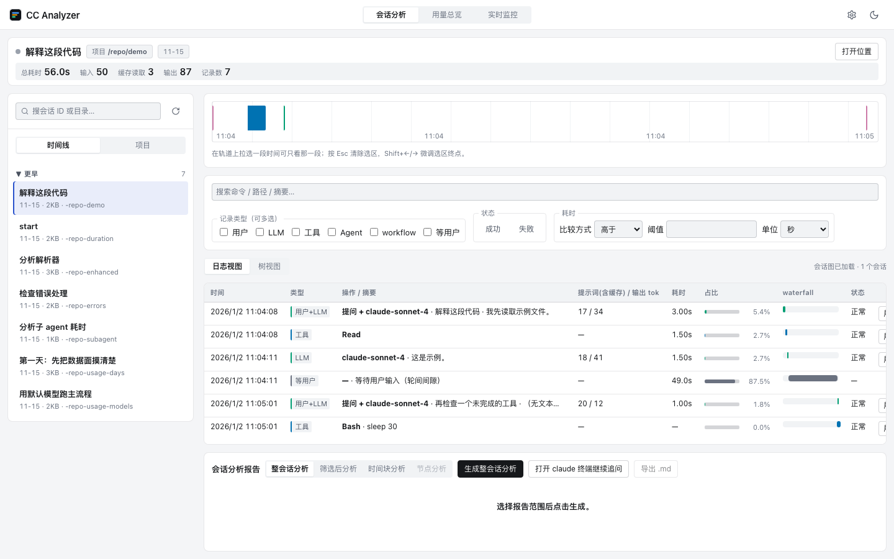
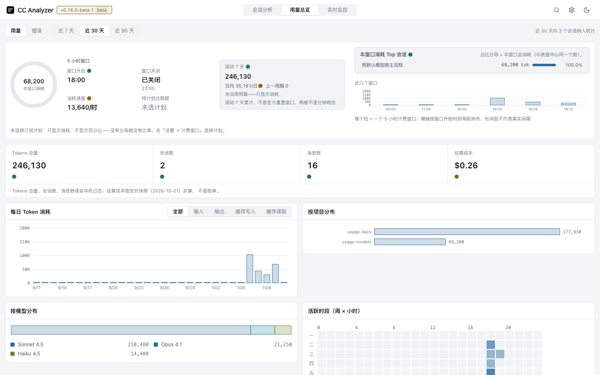

# CC Analyzer

[English](README.md) · [简体中文](README.zh-CN.md)

[](https://github.com/liang-zhenxiang/cc-analyzer/actions/workflows/ci.yml)
[](https://github.com/liang-zhenxiang/cc-analyzer/releases)
[](https://scorecard.dev/viewer/?uri=github.com/liang-zhenxiang/cc-analyzer)
[](LICENSE)

A desktop application for reviewing AI coding session activity — turn your
Claude Code session logs into timelines, duration trees, and structured
analysis reports. Built with Tauri 2 and a React web UI.

Claude subscription plans meter usage in rolling five-hour windows, so the
numbers people check all day are always the same three: when the current
window closes, how much of it is left, and — at the rate you are burning
through it — when you will hit the limit. The usage overview answers all
three from your own logs, with no account and no network call.



The session analyzer with a session open — grouped session list on the left,
filters and the log table in the middle, the analysis report panel below.



The usage overview — the 5-hour billing-window card (current consumption, open
and close times, a burn-rate projection), KPI readouts, and token trends and
distributions for the last 7 / 30 / 90 days, every figure carrying a provenance
badge. Every screen, in both light and dark themes, is archived in
[`docs/screenshots/`](docs/screenshots).

## Features

- **Context forensics (new)** — every Claude Code session carries a context
  that fills up and is occasionally compacted: old messages are rewritten into
  a summary and silently leave the model's working memory. CC Analyzer is the
  first tool that makes this visible and *attributable*. The session's
  **Context** tab draws an "context ECG": the per-call context size (input +
  cache-write + cache-read) as an area chart where each compaction is a cliff.
  Click a cliff to open the forensic card — before/after sizes, tokens
  dropped, duration, trigger (auto/manual), and the surviving-message list
  from the log's own `preservedMessages` — and a **"dropped from context"
  list** that names, message by message, what left the context at that
  boundary (with a *user-only* filter for "when was my constraint dropped").
  Rows jump straight back to the log view. Compaction also appears as a
  full-width band row in the log table, as a **compaction panel** in the
  usage overview (count, cumulative dropped tokens, auto/manual split, top-3
  sessions — the "where did my limit go" narrative), and the log view now
  shows a **parse-coverage chip** when the parser meets record types it does
  not recognize (the report goes to your clipboard only — format drift
  becomes visible instead of silently dropped). No invented numbers: fields
  the log doesn't carry read "not recorded", and no "official context limit"
  line is drawn because no such source exists.
- **Two-tier usage limits** — Claude subscriptions meter usage in two layers;
  the app reads both. The **5-hour billing window**: the current consumption
  dial, when the window opened, a countdown to when it closes, and a projection
  of when you will reach the limit at the current burn rate (clustering matches
  ccusage's `blocks`: five hours from the first activity). The **rolling 7-day
  window**: consumption over `(now − 7d, now]` is an exact figure read from
  your logs, shown with the daily average and the previous period for
  comparison. The weekly budget is an optional number you set yourself — no
  reliable community estimate exists, so plan presets ship without one — and
  the interface says outright that a rolling 7 days is not the official reset
  window. Plan limits are community estimates and are labelled as such; with no
  plan or budget selected the app shows consumption only, never a percentage it
  cannot stand behind — and a window younger than 30 minutes says "not enough
  data" instead of extrapolating. Derived entirely from the local log.
- **Menu-bar readout** — both layers can stay visible in the **macOS menu bar / Windows
  tray**: the label beside the icon carries a single number (a percentage when a budget
  exists, the consumed tokens when it does not), and hovering shows the full two-layer
  reading, when the window closes, and **how many minutes ago the reading was computed** —
  a reading that leans on an estimate says so on its own line instead of passing as fact.
  Read entirely from local logs, never uploaded; hide it in settings and every statistic
  stays exactly as it was.
- **Encrypted archive bundles (moving machines)** — the local archive lives on one machine.
  Settings → Local archive can export it as a **single encrypted file** (`.ccabundle` =
  tar + age passphrase encryption) and import it on another machine. Importing the same
  bundle twice is **idempotent** (the second run reports everything as already present);
  a session that moved on in two places keeps both versions rather than overwriting either.
  The passphrase exists only while you type it — **never stored, never uploaded, no
  recovery**, so a forgotten passphrase means an unopenable bundle; the file is standard
  age, so the `age -d` CLI can decrypt it too. Import writes only into the app's own
  archive directory and never touches `~/.claude`. (Minimum Rust is now 1.85.)
- **Quota attribution ("who is burning this 5-hour window")** — the two limit layers only
  ever said *how much*; the next question is *which session*. The 5-hour card now carries
  a **Top sessions** block: title, tokens consumed inside the window, a share bar and a
  percentage, and clicking a row opens that session. Past five sessions a trailing
  "N other sessions" row keeps the shares from looking like they lost money. There is
  exactly one set of numbers: the window boundaries and the denominator come from the same
  block the gauge is drawn from (share = of this window's total), and a session that spans
  a window boundary is **split by record timestamps** rather than counted whole — so the
  percentages can never disagree with the gauge. Read from local logs only; no inference,
  no network. v1 covers the 5-hour layer; the weekly window and per-model/tool breakdowns
  come later.
- **Global search (⌘K / Ctrl+K)** — message-level search across every project
  and session, results grouped by project → session with the matching snippet
  and a relative time. Enter jumps into the session, opens the record and
  expands its detail panel, so a hit is always reachable, not merely listed.
  The index is built in the background and lives in memory only.
- **Usage overview** — token consumption trends for the last 7 / 30 / 90 days,
  per-project and per-model distributions, and a 7×24 activity heatmap, all
  visible without scrolling on a 1440×900 screen. Every figure carries a
  provenance badge (read from the log / estimated), the estimated cost is
  priced per model against an offline pricing snapshot (date shown), and
  everything is aggregated locally — nothing is uploaded.
- **Session explorer** — sessions grouped by timeline (today / yesterday /
  this week / this month / earlier) and by project, with incrementally
  scanned titles and relative times.
- **Local archive** — copy sessions into the app's own data directory before
  Claude Code prunes them (~30 days), then keep browsing and analysing them
  across months and years. Incremental by mtime/size, raw timestamps preserved,
  originals untouched, nothing uploaded. Archived sessions carry a badge and a
  session whose original is already gone still shows up.
- **Interface font scaling** — five steps (90 / 100 / 110 / 120 / 130%) in
  settings, applied instantly and remembered on this machine. Font sizes and
  line heights scale **together**, so tables, readout rows and chart labels
  grow while spacing, icons and the gauge keep their size — legibility, not a
  zoomed page. The chosen step survives a restart; pick 100% to go back.
- **Log view with one row model** — user / LLM / tool / agent / workflow /
  wait rows plus a full-width **compact-boundary band row** (the compaction
  summary is folded into its expandable section, never counted as user
  speech), with duration and share columns; filter by row kind,
  success/failure, duration range, or free text. Tool output keeps the terminal
  colours it was written with (ANSI SGR, 256-colour and true-colour, carriage
  returns resolved) while every table cell, copy action and export stays plain
  text.
- **Duration tree** — agent and workflow sub-sessions resolved into a graph
  with graph-backed durations; drill into any node or analyse a selected
  time block only.
- **AI analysis reports** — structured prompts sent to your local `claude`
  CLI, rendered as Markdown with syntax highlighting; cancellable at any
  time, with per-node and per-time-block scoping.
- **Export & share** — turn a session into a **single-file HTML report**
  (self-contained: no scripts, no CDN, no fonts to fetch; everything escaped)
  or a **CSV** for Excel and scripts, over the current filter or the whole
  session. Save it through the native dialog or copy it to the clipboard; the
  report carries the project's directory name, never a full path.
- **Session readouts, ruler and keyboard navigation** — the session header
  opens with a readout row (total duration / input / cache read / output /
  records), clicked to expand the token panel; the timeline gained tick marks,
  a hover crosshair and a live selection readout; the three data tables share
  one row-navigation model (↑↓, Home/End, Enter/Space). A button in the header
  copies a ready-to-run `claude --resume` command for that session.
- **Two-channel auto-update** — choose the stable channel (default, promoted
  after maintainer verification) or the beta channel (built automatically each
  feature round), check on demand and install with one click. Packages are
  signature-verified, and a check is a single read of the GitHub releases
  page — no data is uploaded.
- **Realtime monitor** — embeds a local monitoring dashboard you run
  yourself (not shipped in this repo), opened on demand, with a
  floating-window mode.
- **Performance at scale** — windowed, measured-height rendering and chunked
  parsing keep large sessions (tens of MB of JSONL) responsive.
- **Local-first & private** — everything is parsed and rendered locally; the
  app ships no telemetry. Errors say what failed and what to do next; the raw
  error string, which can carry your local paths, stays out of the interface
  unless you expand the details.

## Quick start

### Download

Grab the build for your platform from
[Releases](https://github.com/liang-zhenxiang/cc-analyzer/releases):

| Platform | Download |
| --- | --- |
| macOS Apple Silicon | `CC-Analyzer_<version>_aarch64.dmg` |
| macOS Intel | `CC-Analyzer_<version>_x64.dmg` |
| Windows x64 | `CC-Analyzer_<version>_x64-setup.exe` — installer (Start menu entry, uninstaller) |
| Windows x64 (portable) | `CC_Analyzer_x64_portable.zip` — unzip and run, no installation |

Open the dmg and drag **CC Analyzer** onto the `Applications` shortcut.
macOS bundles are ad-hoc signed: on first launch, right-click the app and
choose **Open** to pass Gatekeeper.

### Build from source

Requirements: Node.js 22 & npm, Rust 1.85+, Xcode Command Line Tools
(macOS) or Visual Studio Build Tools (Windows).

All three platforms go through Tauri's official bundler, so the bundle
identity (`identifier`, `copyright`, installer shape) comes from a single
source: `src-tauri/tauri.conf.json`.

```bash
npm install                    # build toolchain (Tauri CLI)

# macOS Apple Silicon            → dist-arm64/CC Analyzer.app + .dmg
npm run build:macos:arm64

# macOS Intel (cross-compiled)   → dist-intel/CC Analyzer.app + .dmg
npm run build:macos:intel

# Windows (PowerShell)           → dist-windows/ NSIS installer + portable zip
npm run build:windows
```

The packaging scripts under `scripts/` wrap the same commands, so
`./scripts/build-macos.sh x86_64` works too. macOS artifacts use ad-hoc
signing (`signingIdentity: "-"`), which needs no developer certificate.

## Documentation

| Document | Contents |
| --- | --- |
| [docs/USAGE.md](docs/USAGE.md) | Full user guide: install, every feature, data & privacy |
| [docs/ARCHITECTURE.md](docs/ARCHITECTURE.md) | How it works, design decisions and rejected alternatives |
| [docs/TROUBLESHOOTING.md](docs/TROUBLESHOOTING.md) | Symptoms → causes → fixes, searchable error texts |
| [docs/LOCAL_DEVELOPMENT.md](docs/LOCAL_DEVELOPMENT.md) | Local desktop development workflow |
| [docs/CI.md](docs/CI.md) | CI build order and the `frontendDist` pitfall |
| [docs/MAINTAINER_GUIDE.md](docs/MAINTAINER_GUIDE.md) | Release process, repository configuration checklist |
| [CHANGELOG.md](CHANGELOG.md) | Notable changes per version |
| [CONTRIBUTING.md](CONTRIBUTING.md) | How to contribute ([中文](CONTRIBUTING.zh-CN.md)) |
| [SECURITY.md](SECURITY.md) | How to report vulnerabilities, the project's threat model |

## Development

```bash
cd web && npm install && npm run dev   # Vite dev server on 127.0.0.1:5173
cargo run --manifest-path src-tauri/Cargo.toml
```

Pre-push checks — run the layers your change touches. The authoritative rules
(which layer a change needs, and what counts as done) live in
[`.trellis/spec/testing/`](.trellis/spec/testing/index.md), reached from
[`AGENTS.md`](AGENTS.md) → Testing Guidelines; the command list below is a
summary kept in sync with that source.

```bash
./scripts/lint.sh                       # static checks: actionlint, yamllint, shellcheck, zizmor
npm --prefix web test                   # unit / component tests (Vitest)
npm --prefix web run test:e2e           # end-to-end tests (Playwright, Chromium + WebKit)
npm --prefix web run build              # type-check + production build
cargo fmt --manifest-path src-tauri/Cargo.toml --check
cargo clippy --manifest-path src-tauri/Cargo.toml --all-targets -- -D warnings
cargo check --manifest-path src-tauri/Cargo.toml
cargo test --manifest-path src-tauri/Cargo.toml
./scripts/gui-test.sh                   # packaged-app smoke test (a build must exist; run after packaging / IPC changes)
```

## Repository layout

```
web/           React, TypeScript and Vite source for the UI
src-tauri/     Tauri 2 backend: Rust command layer, app config and bundle config, icons
scripts/       packaging entry points, lint entry point, commit-msg validator
docs/          usage, architecture, troubleshooting, maintainer guides
.github/       workflows, issue/PR templates, governance configs
package.json   build toolchain (Tauri CLI) and the packaging entry points
```

## Roadmap

The roadmap tracks open issues; each item links to the issue that owns it.

- [ ] Local archive repo — keep sessions past Claude Code's own cleanup, and
  analyse across months and years
  ([#70](https://github.com/liang-zhenxiang/cc-analyzer/issues/70))
- [x] Structured export — CSV and single-file HTML (shipped in v0.11.0)
  ([#71](https://github.com/liang-zhenxiang/cc-analyzer/issues/71))
- [ ] Accessibility & performance pack — ANSI rendering, virtual scrolling,
  font scaling
  ([#73](https://github.com/liang-zhenxiang/cc-analyzer/issues/73))
- [ ] Frontend upgrade to React 19, moving `@types/react` / `@types/react-dom`
  together
  ([#19](https://github.com/liang-zhenxiang/cc-analyzer/issues/19))

Have an idea? [Open a feature request](https://github.com/liang-zhenxiang/cc-analyzer/issues/new/choose).

## Contributing

Contributions are welcome — bug reports, documentation improvements and pull
requests alike. Start with [CONTRIBUTING.md](CONTRIBUTING.md), run the local
checks, and keep one change per PR.

## Security

Session data is sensitive. The app parses it locally and ships no telemetry;
see [SECURITY.md](SECURITY.md) for the threat model and how to report
vulnerabilities privately.

## License

[MIT](LICENSE). Third-party notices: [NOTICE](NOTICE).
